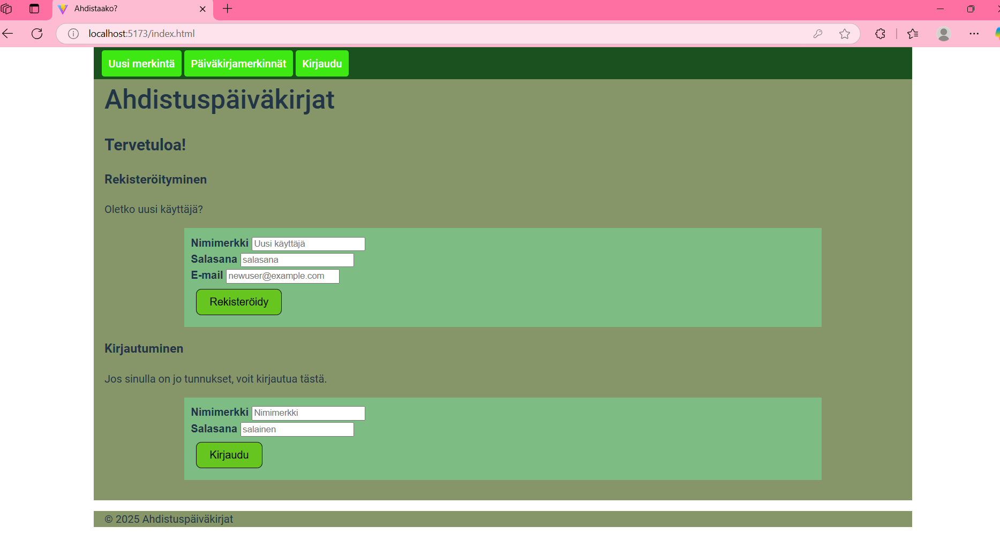
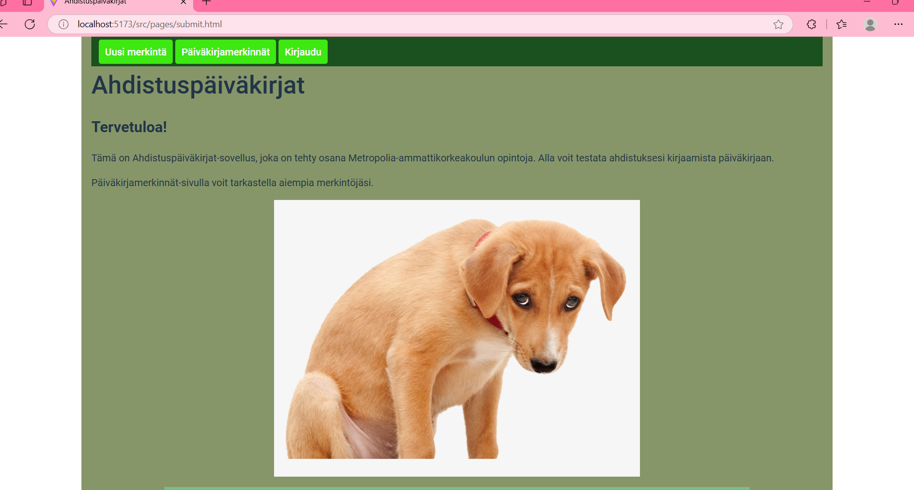
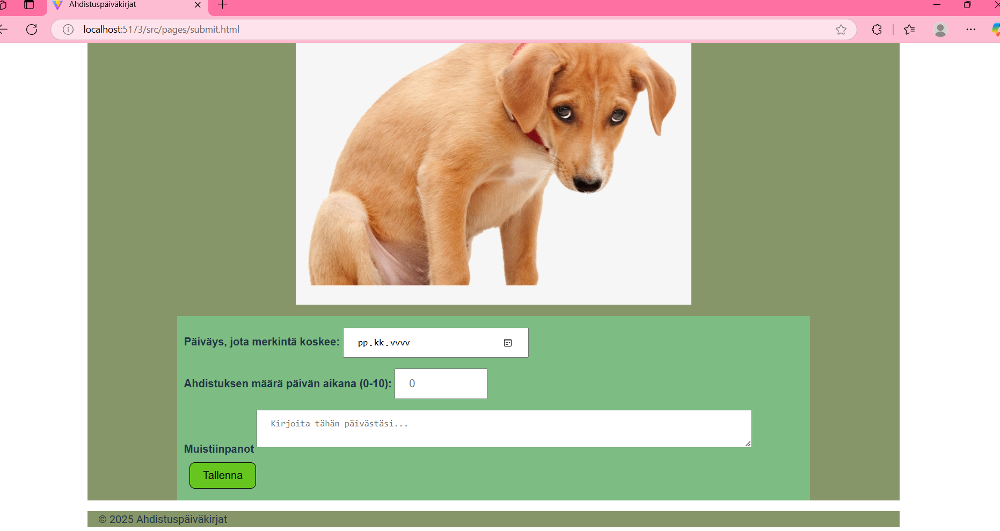
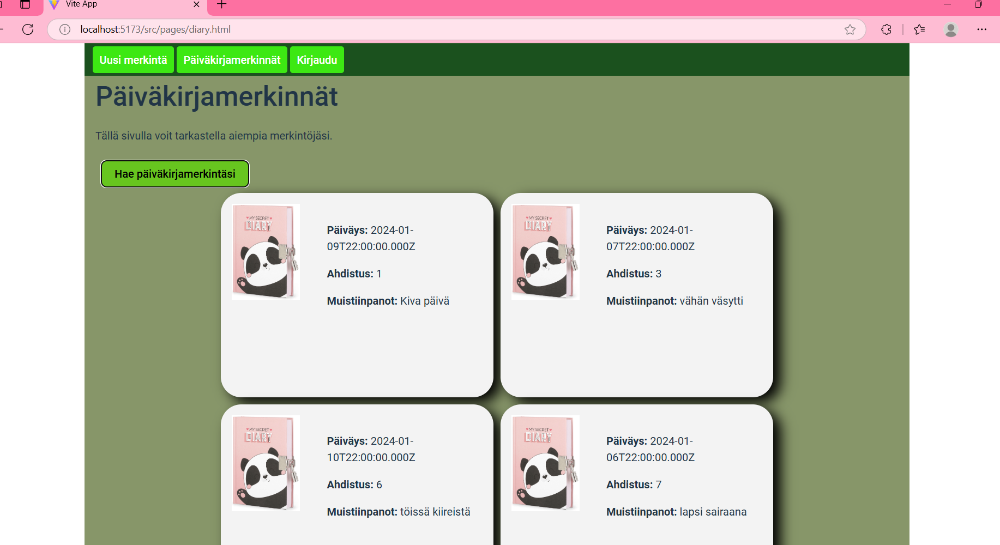
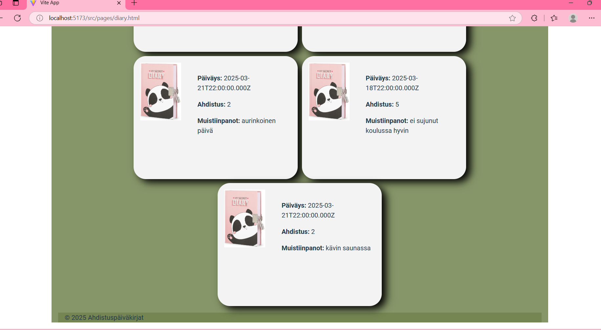

Kuvia käyttöliittymästä:

```markdown

```

```markdown

```

```markdown

```

```markdown

```

```markdown

```
TOIMII: Rekisteröinnin kautta pystyy lisäämään uusia käyttäjiä ja kirjautumisesta kirjautumaan sisään.
TOIMII: Kirjautuneena voi lisätä uusia merkintöjä sekä hakea omat merkintänsä päiväkirjasta.

VIIMEISTELEMÄTTÄ: Jotkut lomakkeet eivät tyhjenny heti tallennuksen jälkeen. Uloskirjautumisnappulaa ei ole. 
Päiväkirjasivulla kummittelee yksi tyhjä merkintäkortti ennen merkintöjen hakua.

Tietokannassa on taulut users ja diaryentries(viiteavaimena user_id).
